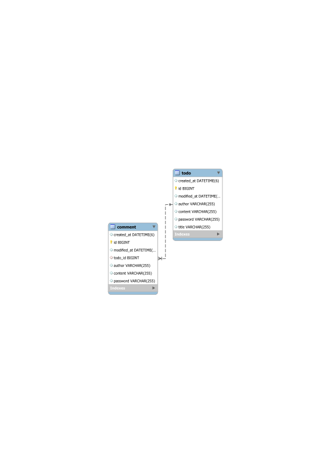

# 🚀 Spring Boot Todo 애플리케이션

> 💬 **"단순한 Todo 앱을 넘어, 견고한 백엔드 설계를 경험하다"**

이 프로젝트는 단순한 기능 구현을 넘어, **유지보수성과 확장성**을 고려한 소프트웨어 설계를 체험하는 데 중점을 둔 Todo 애플리케이션입니다. 도메인 주도 설계(DDD)의 기본 원칙을 적용하여 각 기능의 독립성을 높이고, 클린 아키텍처를 지향합니다.

---

## 🎯 프로젝트 핵심 목표 및 설계 철학

- **도메인 분리 (Domain Separation)**: `todo`와 `comment`라는 명확한 도메인 경계를 설정하여, 각자의 책임과 역할을 분리했습니다. 이를 통해 코드의 응집도를 높이고 결합도를 낮추어, 기능 변경 및 확장이 용이한 구조를 만들었습니다.
- **계층형 아키텍처 (Layered Architecture)**: `Controller` - `Service` - `Repository`로 이어지는 명확한 계층 구조를 적용하여 각 레이어의 책임을 분명히 하고, 데이터의 흐름을 직관적으로 파악할 수 있도록 설계했습니다.
- **객체지향 원칙 준수**: 각 도메인 객체(`Todo`, `Comment`)가 스스로의 상태와 행위를 관리하도록 구현하여, 객체의 자율성과 캡슐화를 극대화했습니다. 특히, **개방-폐쇄 원칙(OCP)** 을 준수하기 위해 Specification 패턴과 빌더를 적용하여, 새로운 검색 조건이 추가되어도 서비스 계층의 변경 없이 확장할 수 있는 구조를 구현했습니다.
- **예외 처리의 체계화**: 애플리케이션 전역에서 발생할 수 있는 예외를 `@RestControllerAdvice`를 통해 일관되게 처리하고, 도메인 비즈니스 규칙에 따른 예외는 `BusinessException`으로 명확하게 정의하여 코드의 안정성과 예측 가능성을 높였습니다.

## ✨ 주요 기능 하이라이트

- **할일(Todo) 및 댓글(Comment) 관리**: 기본적인 CRUD 기능을 완벽하게 지원합니다.
- **확장 가능한 동적 검색**: **JPA Specification(명세)** 패턴을 도입하여, 작성자 이름 등 다양한 조건에 따른 할일 목록을 동적으로 조회할 수 있습니다. Specification Builder를 구현하여 새로운 검색 조건이 추가되어도 기존 코드를 수정할 필요 없는, OCP를 준수하는 설계를 적용했습니다.
- **안전한 인증**: **jBCrypt** 라이브러리를 사용하여 사용자의 비밀번호를 단방향 암호화하여 안전하게 저장하고, 수정/삭제 시 비밀번호를 검증합니다.
- **데이터 유효성 검사**: `@Valid` 어노테이션과 커스텀 Validation 어노테이션을 활용하여 API 요청 데이터의 정합성을 보장합니다.
- **객체 매핑 자동화**: **MapStruct**를 적용하여 DTO와 Entity 간의 변환 코드를 컴파일 타임에 자동으로 생성함으로써, 반복적인 보일러플레이트 코드를 제거하고 런타임 성능 저하를 방지했습니다.

## 🛠️ 적용 기술

| 구분 | 기술 | 설명 |
|---|---|---|
| **Framework** | `Spring Boot 3.5.4` | 강력하고 빠른 애플리케이션 개발 환경 | 
| **Language** | `Java 17` | 안정성과 성능이 검증된 LTS 버전 | 
| **Database** | `Spring Data JPA`, `MySQL` | ORM을 통한 객체지향적 데이터 관리 | 
| **Query** | `JPA Specification` | 타입-세이프한 동적 쿼리 빌더 | 
| **Security** | `jBCrypt` | 강력한 해시 함수를 이용한 비밀번호 암호화 | 
| **Code-Gen** | `MapStruct`, `Lombok` | 보일러플레이트 코드 자동 생성 및 제거 | 
| **Build Tool** | `Gradle` | 유연하고 빠른 빌드 자동화 도구 | 

## 📁 프로젝트 구조

```
.
├── src
│   └── main
│       └── java
│           └── indiv/abko/todo
│               ├── global          # 🌐 전역 설정 및 공통 모듈
│               │   ├── dto         #   - 공통 응답 DTO
│               │   ├── exception   #   - 글로벌 예외 처리 핸들러
│               │   └── util        #   - 암호화 등 공통 유틸리티
│               └── todo            # 📝 Todo 도메인 패키지
│                   ├── comment     #   - 💬 Comment 하위 도메인
│                   ├── controller  #   - API 엔드포인트
│                   ├── dto         #   - 데이터 전송 객체
│                   ├── entity      #   - JPA 엔티티
│                   ├── mapper      #   - MapStruct 매퍼 인터페이스
│                   ├── repository  #   - 데이터 액세스 (JPA, Specification)
│                   └── service     #   - 비즈니스 로직
└── ...
```

## 💾 ERD (Entity-Relationship Diagram)



## 🚀 시작하기

1.  **저장소 복제**
    ```bash
    git clone https://github.com/VBKOROA/sprt-spring-todo.git
    ```
2.  **데이터베이스 설정**
    - `src/main/resources/application.properties` (또는 `application.yml`) 파일을 생성하고, 본인의 MySQL 데이터베이스 정보를 입력하세요.
3.  **애플리케이션 실행**
    ```bash
    ./gradlew bootRun
    ```
